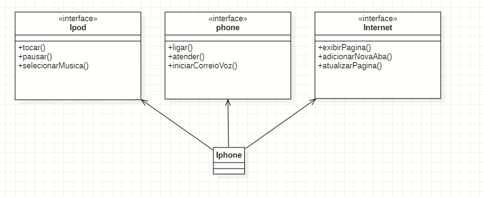

# diagramacao_UML_Iphone
Desafio da DIO- Diagramação UML do Iphone 2007

Projeto Base: Orientação a Objetos e UML: Diagramação de Classes do iPhone

POO

Git Hub

Java

# ♨️♨️♨️♨️♨️♨️♨️♨️♨️♨️♨️♨️♨️

 # 👩🏽‍💻 Desafio de projeto DIO 👩🏽‍💻

# 🖇️🖇️🖇️🖇️🖇️🖇️🖇️🖇️🖇️🖇️🖇️🖇️🖇️

Modelagem e diagramação da representação em UML e Código no que se refere ao componente iPhone Com base no vídeo de lançamento do iPhone conforme link abaixo, elabore em uma ferramenta de UML de sua preferência a diagramação das classes e interfaces com a proposta de representar os papeis do iPhone de Reprodutor Musical, Aparelho Telefônico e Navegador de Internet. Em seguida crie as classes

e interfaces no formato de arquivos .java

Descrição: Nesse desafio, implementei interfaces (Ipod, Iphone e Internet), fiz uma interação com o usuário simulando uma interação com um iphone.

> Minutos relevantes do 00:15 até 00:55

comportamentos esperados:

- Reprodutor Musical: tocar, pausar, selecionarMusica

- Aparelho Telefônico: ligar, atender, iniciarCorreioVoz

- Navegador na Internet: exibirPagina, adicionarNovaAba, atualizarPagina

